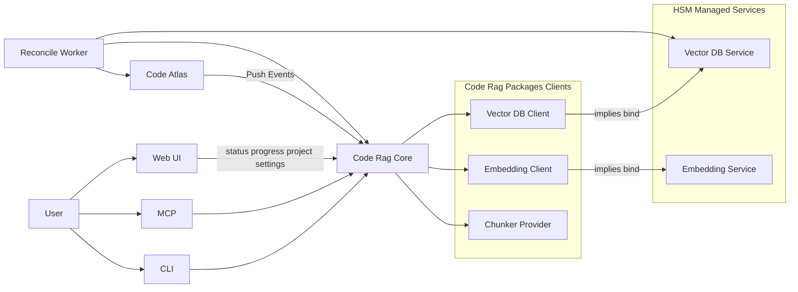

# Архитектура сервиса code-rag (rag4code) — Stage 2

> **Status**: Accepted
>
> **Date**: 2026-02-20
>
> **Specification**: [Stage 2 Specification](architecture/stage-2-specification.md)

## 1. Контекст

`code-rag` это автономный сервис семантического поиска по коду в экосистеме HyperGraph.

На Stage 2 принята модель:
- автономная работа `code-rag` без обязательной зависимости от `code-atlas`;
- опциональная интеграция с `code-atlas` через Push-first контракт;
- совместимость с HSM подходом `libraries -> services` через `implies`.

Связанный интеграционный контекст: [ADR 003 code-atlas](../../code-atlas/docs/adr/0003-rag-integration-strategy.md).

## 2. Архитектурные принципы

1. **Autonomous First**
   - Базовая индексация и поиск работают без `code-atlas`.

2. **Optional Integration Ports**
   - Подключение `code-atlas` не ломает standalone контур.

3. **Single Active Vector Backend**
   - В одном runtime активен один backend векторной БД.
   - Мульти-кейсы обеспечиваются неймспейсами.

4. **Plugin Driven Core**
   - Плагины `vector_db`, `embedder`, `chunker` подключаются через entry points.

5. **Git Aware Safety**
   - Индекс хранит source и index аудит.
   - Reconcile поддерживает два режима: `dry_run` и `fix`.

## 3. HSM модель для code-rag

`services/code-rag/packages` это Python-пакеты клиентов, которые взаимодействуют с внешними сервисами.

Сервисы запускаются HSM как:
- docker контейнеры;
- изолированные python окружения VES.

Связка делается через `implies`:
- абстрактный клиент заявляет потребность в абстрактном сервисе;
- конкретная реализация клиента связывается с конкретным сервисом.

Пример соответствия:
- `vector-db-client` -> `vector-db-service` абстрактный слой;
- `qdrant-client` -> `qdrant-service` конкретный слой.

## 4. Компонентная схема

## 5. Потоки данных

### 5.1 Локальная индексация
1. Вызов из CLI, MCP или Web UI.
2. Core использует `chunker`.
3. Core получает эмбеддинги через `embedder client`.
4. Core пишет в активный namespace vector backend.

Web UI также используется для:
- отображения статуса индексации;
- отображения прогресса обработки чанков;
- выбора проекта и параметров обработки.

### 5.2 Push-first интеграция с code-atlas
1. `code-atlas` отправляет batch событий.
2. Core валидирует версию контракта.
3. Core индексирует контент с привязкой к `node_id`.
4. Core возвращает acceptance report.

### 5.3 Поиск
1. Запрос в Core.
2. Векторизация запроса.
3. Поиск по namespace.
4. Возврат результатов с аудит метаданными.

### 5.4 Reconcile
Поддерживаются оба режима:
- `dry_run`: проверить состояние и вернуть diff отчет;
- `fix`: применить исправления по найденным рассинхронизациям.

## 6. Storage topology

- Один активный vector backend в процессе.
- Namespace key:

`project_key / purpose / chunk_strategy`

Примеры:
- `purpose`: `code_search`, `atlas_graph`, `docs_search`
- `chunk_strategy`: `simple_file_chunks`, `code_aware`, `markdown_headings`, `code_atlas_provider`

## 7. Плагинные контракты

Группы entry points:
- `rag4code.vector_db`
- `rag4code.embedder`
- `rag4code.chunker`

Базовое решение зафиксировано в [ADR 002](adr/002-plugin-system-entrypoints.md).

## 8. Интеграционные границы c code-atlas

`code-atlas` зона ответственности:
- граф и стабильные `node_id`;
- поставка структурного контента и source метаданных.

`code-rag` зона ответственности:
- чанкинг эмбеддинги векторный индекс;
- retrieval;
- reconcile и отчеты синхронизации.

## 9. Трассируемость

Индекс хранит два слоя аудита:

1. **Source Audit**
   - источник артефакта и snapshot кода
2. **Index Audit**
   - факт и параметры индексации внутри `code-rag`

Подробный формат полей и payload описан в [Stage 2 Specification](architecture/stage-2-specification.md).
