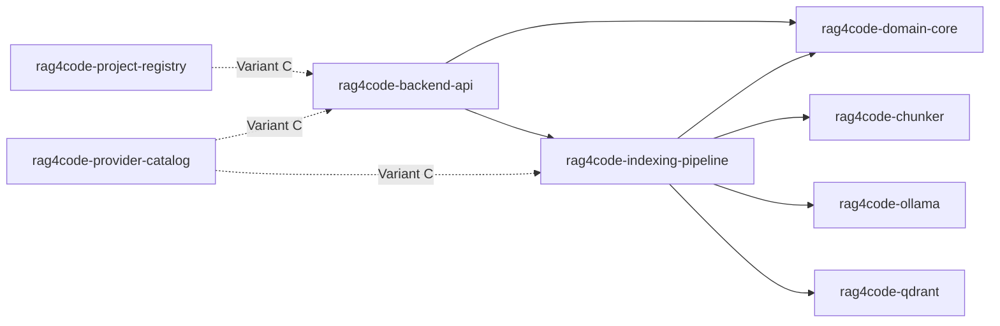

# План: Backend package architecture — Variant B now, Variant C later

## 1. Решение

Принято архитектурное решение:
- **Сейчас реализуем Variant B** как основной target для backend.
- **Переход к Variant C** фиксируем как эволюционный roadmap без breaking contracts.

## 2. Package boundaries

### 2.1 Variant B (текущий target)

Базовые reusable packages:
- `rag4code-domain-core`
- `rag4code-indexing-pipeline`
- `rag4code-backend-api`

Существующие adapter packages сохраняются:
- `rag4code-chunker`
- `rag4code-qdrant`
- `rag4code-ollama`

### 2.2 Variant C (следующий этап)

К Variant B добавляются:
- `rag4code-project-registry`
- `rag4code-provider-catalog`

## 3. Зоны ответственности

### `rag4code-domain-core`
- Доменные модели и инварианты.
- Статусы и lifecycle для indexing job.
- Ошибки доменного уровня и нормализация provider error codes.
- Базовые интерфейсы и contract-safe DTO для internal слоя.

### `rag4code-indexing-pipeline`
- Application orchestration use-cases.
- Поток `chunk -> embed -> upsert`.
- Управление progress updates и transition hooks.
- Точки расширения для retry/cancel policy.

### `rag4code-backend-api`
- HTTP transport boundary.
- Mapping `request/response` по OpenAPI.
- Validation и `error envelope` serialization.
- API composition поверх domain/pipeline.

### `rag4code-chunker`
- Chunking strategies и plugin implementation.

### `rag4code-qdrant`
- Vector DB adapter, storage/search integration.

### `rag4code-ollama`
- Embedding provider adapter.
- Provider-specific request/response mapping.
- Ошибки, таймауты, устойчивость к network проблемам.

### Variant C additions

#### `rag4code-project-registry`
- Отдельный bounded context управления проектами.
- CRUD/persistence policy и consistency checks.

#### `rag4code-provider-catalog`
- Catalog endpoints и provider capabilities.
- Defaults/model-aware settings для frontend forms.

## 4. Зависимости между пакетами

## 5. Правила dev/prod подключения через HSM

- Каждый package должен поддерживать режимы **dev** (local editable source) и **prod** (versioned artifact).
- Backend service подключает package-layer через dependency graph и entry points.
- Для dev режима приоритет у local source path.
- Для prod режима приоритет у version-pinned package.

## 6. Non-breaking migration B -> C

- Публичные API contracts сохраняются совместимыми.
- Выделение `project-registry` и `provider-catalog` выполняется через internal extraction.
- Сначала переносим implementation, потом стабилизируем import boundaries.
- Завершаем migration только после contract и integration проверок.

## 7. Связь с текущими артефактами

- Architecture baseline: [`docs/architecture.md`](docs/architecture.md)
- Stage 3 input: [`plans/stage-3-planning-input.md`](plans/stage-3-planning-input.md)
- Backend contracts: [`services/code-rag-backend/docs/contracts/web-ui.openapi.yaml`](services/code-rag-backend/docs/contracts/web-ui.openapi.yaml)
- Plugin mechanism: [`services/code-rag-backend/docs/theory/entry_points_mechanism.md`](services/code-rag-backend/docs/theory/entry_points_mechanism.md)

## 8. Handoff order для Code mode

Рекомендуемый порядок выполнения без конфликтов между frontend и backend:

1. Frontend foundation:
   - [`tasks_descriptions/tasks/task-05a-frontend-bootstrap-vite-tailwind.md`](tasks_descriptions/tasks/task-05a-frontend-bootstrap-vite-tailwind.md)
   - [`tasks_descriptions/tasks/task-05b-frontend-routing-navigation-contract.md`](tasks_descriptions/tasks/task-05b-frontend-routing-navigation-contract.md)
   - [`tasks_descriptions/tasks/task-05c-app-shell-layout-dark-ide-style.md`](tasks_descriptions/tasks/task-05c-app-shell-layout-dark-ide-style.md)
2. Backend package baseline Variant B:
   - [`tasks_descriptions/tasks/task-12a-backend-domain-core-package-extraction.md`](tasks_descriptions/tasks/task-12a-backend-domain-core-package-extraction.md)
   - [`tasks_descriptions/tasks/task-12b-backend-indexing-pipeline-package-extraction.md`](tasks_descriptions/tasks/task-12b-backend-indexing-pipeline-package-extraction.md)
   - [`tasks_descriptions/tasks/task-12c-backend-api-package-and-openapi-binding.md`](tasks_descriptions/tasks/task-12c-backend-api-package-and-openapi-binding.md)
   - [`tasks_descriptions/tasks/task-12d-ollama-adapter-production-hardening.md`](tasks_descriptions/tasks/task-12d-ollama-adapter-production-hardening.md)
3. Frontend интеграционный слой и завершение T05:
   - [`tasks_descriptions/tasks/task-05d-ui-placeholders-loading-error-empty.md`](tasks_descriptions/tasks/task-05d-ui-placeholders-loading-error-empty.md)
   - [`tasks_descriptions/tasks/task-05e-frontend-docker-hsm-runtime-wiring.md`](tasks_descriptions/tasks/task-05e-frontend-docker-hsm-runtime-wiring.md)
   - [`tasks_descriptions/tasks/task-05f-frontend-verification-and-code-handoff.md`](tasks_descriptions/tasks/task-05f-frontend-verification-and-code-handoff.md)
4. После стабилизации контрактов и smoke-проверок запускается roadmap B -> C:
   - [`tasks_descriptions/tasks/task-13-backend-evolution-b-to-c-roadmap.md`](tasks_descriptions/tasks/task-13-backend-evolution-b-to-c-roadmap.md)
