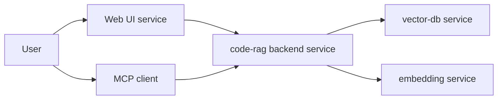

# Stage 3 Planning Input for code-rag

Цель: подготовить Stage 3 (Planning) артефакты так, чтобы задачи можно было декомпозировать без додумывания.

## 1. Уточнение HSM Assembly Model (Stage 2 -> Stage 3)

В терминах HSM:

- Центральный проект `services/code-rag` рассматриваем как тонкий адаптер, который через HSM подключает:
  - backend `code-rag` как service (runtime: `uv` VES, host process)
  - frontend Web UI как service (runtime: Docker container)
  - зависимости как services (например vector DB, embedding server)

Минимальная целевая модель связей:

Источник: high-level схема и HSM модель уже описаны в [`docs/architecture.md:39`](docs/architecture.md:39) и Stage 2 спецификации.

## 2. Контрактная зона Stage 3: `services/code-rag-backend/docs/contracts/`

Stage 2 зафиксировал контракты в виде примеров и требований (см. [`docs/architecture/stage-2-specification.md:90`](docs/architecture/stage-2-specification.md:90)), но для Contract-First разработки на Stage 3 нужен формализованный пакет схем.

### 2.1 Предлагаемая структура

- [`services/code-rag-backend/docs/contracts/README.md`](services/code-rag-backend/docs/contracts/README.md)
- [`services/code-rag-backend/docs/contracts/v1/`](services/code-rag-backend/docs/contracts/v1/)
  - [`services/code-rag-backend/docs/contracts/v1/push_batch.schema.json`](services/code-rag-backend/docs/contracts/v1/push_batch.schema.json)
  - [`services/code-rag-backend/docs/contracts/v1/push_item.schema.json`](services/code-rag-backend/docs/contracts/v1/push_item.schema.json)
  - [`services/code-rag-backend/docs/contracts/v1/push_acceptance.schema.json`](services/code-rag-backend/docs/contracts/v1/push_acceptance.schema.json)
  - [`services/code-rag-backend/docs/contracts/v1/reconcile_request.schema.json`](services/code-rag-backend/docs/contracts/v1/reconcile_request.schema.json)
  - [`services/code-rag-backend/docs/contracts/v1/reconcile_response.schema.json`](services/code-rag-backend/docs/contracts/v1/reconcile_response.schema.json)
  - [`services/code-rag-backend/docs/contracts/v1/query_request.schema.json`](services/code-rag-backend/docs/contracts/v1/query_request.schema.json)
  - [`services/code-rag-backend/docs/contracts/v1/query_response.schema.json`](services/code-rag-backend/docs/contracts/v1/query_response.schema.json)
  - [`services/code-rag-backend/docs/contracts/v1/error_envelope.schema.json`](services/code-rag-backend/docs/contracts/v1/error_envelope.schema.json)
  - [`services/code-rag-backend/docs/contracts/v1/provider_capabilities.schema.json`](services/code-rag-backend/docs/contracts/v1/provider_capabilities.schema.json)

Примечание: на этом шаге файлы `*.schema.json` являются целевыми артефактами (их создаст GPT-5.2-Codex). Текущий файл фиксирует только структуру и правила.

### 2.2 Версионирование

- Все схемы в `v1/` совместимы с `contract_version = 1.0` из [`docs/architecture/stage-2-specification.md:96`](docs/architecture/stage-2-specification.md:96).
- Изменение структуры любого контракта:
  - если breaking -> новая директория `v2/`
  - если non-breaking -> расширение схемы внутри текущего `v1/`

## 3. Web UI: граница и API-ресурсы (без структур полей)

Stage 2 Web UI требования: см. [`docs/architecture/stage-2-specification.md:295`](docs/architecture/stage-2-specification.md:295).

Для Stage 3 нужен отдельный Web API контракт (предпочтительно OpenAPI). Минимальный набор ресурсов:

- Projects
  - list projects (для UI списка и переключения)
  - create project (по path + display name)
  - update project (rename display name)
  - get project details

- Indexing
  - start indexing (project + chunker settings + embedder settings)
  - get indexing status (state + progress)
  - stop indexing (если поддерживаем)

- Settings catalogs
  - list available chunkers + default settings
  - list available embedders + default settings

## 4. Test Design: что должно перейти в Stage 3

Stage 2 содержит базовую матрицу L1–L4 в [`docs/architecture/stage-2-specification.md:258`](docs/architecture/stage-2-specification.md:258), включая UI flows и Frontend & Visual Assurance.

На Stage 3 цель тестов: перевести этот дизайн в конкретные test cases и harness:

- L2 Contract tests должны ссылаться на файлы схем из [`services/code-rag-backend/docs/contracts/v1/`](services/code-rag-backend/docs/contracts/v1/)
- L4 UI tests: Playwright E2E + Visual Regression, минимум Chromium и Firefox

## 5. Входные атомарные задачи для Stage 3 (Planning)

Ниже список задач, которые можно превратить в файлы в `tasks_descriptions/tasks/`.

### 5.1 Contract-First пакет
1) Создать [`services/code-rag-backend/docs/contracts/README.md`](services/code-rag-backend/docs/contracts/README.md) и пакет схем `v1/` (json schema или yaml)
- DoD: схемы покрывают push, reconcile, query, error envelope, provider capabilities; примеры из Stage 2 проходят валидацию.

2) Создать Web API контракт для UI (OpenAPI или эквивалент)
- DoD: определены ресурсы Projects, Indexing, Settings catalogs; прописаны ошибки через error envelope.

### 5.2 Backend: project registry и статус индексации
3) Project registry (CRUD)
- DoD: backend умеет хранить и возвращать список проектов (path + display name) для UI.

4) Indexing job model и progress reporting
- DoD: backend возвращает status и progress в стабильной форме; UI может отображать progress bar.

### 5.3 UI (React, Docker)
5) UI skeleton + routing
- DoD: список проектов, экран проекта, экран настроек.

6) UI progress + status
- DoD: progress bar и статусы отображаются и обновляются.

7) UI settings
- DoD: формы настроек chunker (`chunk_size`, `chunk_overlap`) и embedder model (Stage 2: `qwen3-embedding`).

### 5.4 Testing
8) L2 contract tests по схемам
- DoD: отдельный набор тестов валидирует payloads на границах.

9) L4 UI tests
- DoD: Playwright E2E happy path + visual regression snapshots; запуск минимум на Chromium и Firefox.
