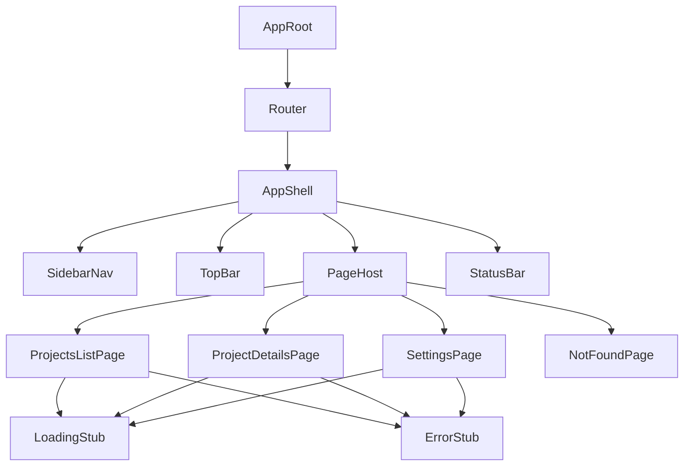
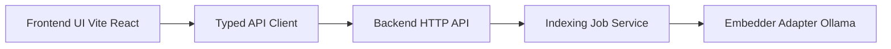

# T05 Архитектурный план: UI Skeleton и Routing

## 1. Scope и Goal

Задача [`tasks_descriptions/tasks/task-05-ui-skeleton-routing.md`](tasks_descriptions/tasks/task-05-ui-skeleton-routing.md) — следующий приоритет реализации в Stage 5.

Целевой результат:
- React frontend skeleton в [`services/code-rag-frontend/`](services/code-rag-frontend/)
- стабильный routing для трех ключевых экранов
- базовый layout с navigation и placeholder-блоками
- Docker runtime интеграция, согласованная с HSM-моделью в [`hsm.yaml`](hsm.yaml)

## 2. Inputs и Constraints

- требования Stage 3 по UI: [`plans/stage-3-planning-input.md`](plans/stage-3-planning-input.md:110)
- текущие архитектурные boundaries: [`docs/architecture.md`](docs/architecture.md:70)
- регистрация frontend service: [`hsm-registry/services/code-rag-frontend.yaml`](hsm-registry/services/code-rag-frontend.yaml:1)
- downstream-задачи, которые зависят от skeleton:
  - [`tasks_descriptions/tasks/task-06-ui-progress-status.md`](tasks_descriptions/tasks/task-06-ui-progress-status.md)
  - [`tasks_descriptions/tasks/task-07-ui-settings-forms.md`](tasks_descriptions/tasks/task-07-ui-settings-forms.md)

## 3. Принятый Technical Baseline

- stack: React + TypeScript + Vite + React Router + Docker
- styling: Tailwind CSS
- visual direction:
  - professional IDE-like dark UI
  - сдержанные cyberpunk accents для узнаваемости и фокуса
  - без heavy game-like эффектов

Design references:
- [`../../hsm/website/src/css/custom.css`](../../hsm/website/src/css/custom.css:15)
- [`../../hsm/website/src/pages/index.tsx`](../../hsm/website/src/pages/index.tsx:30)
- [`../../../agent_proj/lifelong_learning_assistant/web_ui_service/frontend/react/src/index.css`](../../../agent_proj/lifelong_learning_assistant/web_ui_service/frontend/react/src/index.css:3)

## 4. Route Contract для T05

Обязательные routes в skeleton:
- `/projects` -> Projects List page
- `/projects/:projectId` -> Project Details page
- `/settings` -> Settings page
- `/` -> redirect на `/projects`
- `*` -> Not Found placeholder

### Page-level placeholders

Каждая route page должна содержать:
- loading stub block
- error stub block
- empty-content block

Эти placeholders фиксируем уже в T05, чтобы избежать redesign churn в T06 и T07.

## 5. Frontend Component Architecture



### Shell responsibilities

- `AppShell`: статический frame и responsive зоны
- `SidebarNav`: route navigation и active section highlight
- `TopBar`: заголовок текущей страницы и легкие context badges
- `StatusBar`: service status strip и короткая diagnostics строка
- `PageHost`: рендер текущего route content

## 6. Предлагаемый Directory Blueprint

```text
services/code-rag-frontend/
  package.json
  tsconfig.json
  vite.config.ts
  index.html
  postcss.config.cjs
  tailwind.config.ts
  Dockerfile
  Dockerfile.dev
  nginx.conf
  .dockerignore
  src/
    main.tsx
    app/
      App.tsx
      router.tsx
    layout/
      AppShell.tsx
      SidebarNav.tsx
      TopBar.tsx
      StatusBar.tsx
    pages/
      projects/
        ProjectsListPage.tsx
        ProjectDetailsPage.tsx
      settings/
        SettingsPage.tsx
      NotFoundPage.tsx
    components/
      stubs/
        LoadingStub.tsx
        ErrorStub.tsx
        EmptyStub.tsx
    styles/
      index.css
      tokens.css
```

## 7. UI Style System для Skeleton

Минимальный token set для Tailwind-theme:
- background layers: app background, surface, elevated panel
- text hierarchy: primary text, muted text
- accent palette: cyan как primary accent, lime как optional highlight
- border palette: subtle default border и active accent border

Принципы:
- accent-color только для focus и key controls
- сначала readability и contrast, затем decorative effects
- без постоянного сильного glow, только hover или focus states

## 8. Docker и HSM Integration Plan

### Runtime model

- Dev profile: Vite dev server в container с bind mount source-кода
- Prod profile: build static assets и serve через nginx

### Service contract updates в registry

Планируемые изменения в [`hsm-registry/services/code-rag-frontend.yaml`](hsm-registry/services/code-rag-frontend.yaml:1):
- задать явный `container_name`
- определить frontend `ports`
- определить source `volumes` для dev profile
- добавить env-contract для backend API URL

### Environment contract для frontend

- `VITE_API_BASE_URL` для backend HTTP API
- optional `VITE_APP_TITLE` для branding label

## 9. Requirement Traceability

- Requirement: три ключевых экрана -> Artifacts: route pages в `src/pages/*`
- Requirement: стабильный routing -> Artifacts: router config в `src/app/router.tsx`
- Requirement: loading и error placeholders -> Artifacts: `src/components/stubs/*`
- Requirement: Docker-based UI service -> Artifacts: Dockerfiles и service config в registry

## 10. Verification Plan для Code Mode

Минимальные verification checks:
1. frontend app стартует в dev mode внутри container
2. route navigation работает для `/projects`, `/projects/:projectId`, `/settings`
3. direct URL open для каждого route функционирует
4. placeholder blocks видимы на всех трех страницах
5. production static build отдается через nginx container

## 11. Handoff Plan в Code Mode

Последовательность реализации:
1. bootstrap Vite React TypeScript app в [`services/code-rag-frontend/`](services/code-rag-frontend/)
2. добавить Tailwind baseline и token-файл
3. реализовать `AppShell` и routing map
4. добавить три страницы и generic stubs
5. добавить Docker-файлы для dev и prod
6. обновить frontend service registry и проверить HSM wiring
7. выполнить route и container verification checks

Execution note:
- T05 намеренно не включает глубокую backend data integration
- data fetching и progress logic выносятся в T06 и T07

## 12. Когда реализуем backend, который общается с embedding model

Короткий ответ: сразу после завершения T05-пакета, параллельно с T06/T07 по frontend.

Предлагаемая очередность по этапам:
1. Закрыть foundation UI через T05A-T05F.
2. Завести backend implementation задачу на реальный embedder adapter поверх контрактов и lifecycle-модели.
3. Подключить API endpoints для Projects, Indexing и Settings поверх уже подготовленных доменных сервисов.
4. Включить frontend integration через typed API client и polling статусов.

Текущая база для этого уже есть:
- lifecycle статусов готов в [`services/code-rag-backend/src/code_rag_backend/core/indexing_job.py`](services/code-rag-backend/src/code_rag_backend/core/indexing_job.py:182)
- engine orchestration и plugin factory готовы в [`services/code-rag-backend/src/code_rag_backend/core/engine.py`](services/code-rag-backend/src/code_rag_backend/core/engine.py:7) и [`services/code-rag-backend/src/code_rag_backend/core/factory.py`](services/code-rag-backend/src/code_rag_backend/core/factory.py:9)
- API контракт уже зафиксирован в [`services/code-rag-backend/docs/contracts/web-ui.openapi.yaml`](services/code-rag-backend/docs/contracts/web-ui.openapi.yaml)

Важно: текущий Ollama adapter пока заглушка с dummy vector в [`services/code-rag-backend/packages/rag4code-ollama/src/rag4code_ollama/adapter.py`](services/code-rag-backend/packages/rag4code-ollama/src/rag4code_ollama/adapter.py:12), поэтому production-ready интеграция с моделью — это отдельный следующий backend шаг.

## 13. Как сцеплять frontend и backend

Основной принцип: Contract-First интеграция по OpenAPI + единый runtime wiring через HSM.

Интеграционная схема:



Практически это сцепляется так:
- Frontend читает base URL из `VITE_API_BASE_URL`.
- Все вызовы идут через единый API-client module, который типизирован по OpenAPI.
- Polling статуса индексации идет по endpoint статусов, UI отображает `queued/running/completed/failed/canceled`.
- Ошибки backend нормализуются через error envelope, frontend показывает единый `ErrorStub`.
- Docker/HSM wiring фиксируется в [`hsm-registry/services/code-rag-frontend.yaml`](hsm-registry/services/code-rag-frontend.yaml:1) и в backend service config.

Граница ответственности:
- backend отвечает за модель, индексацию, provider errors, контракты;
- frontend отвечает за UX flow, формы настроек, визуализацию progress/status и retry-сценарии.
