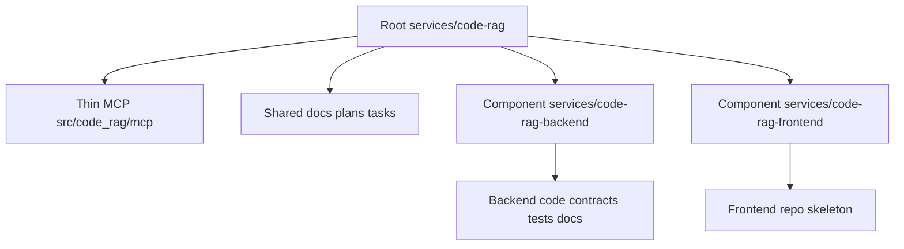

# T11 Remediation Architecture Plan (GAP-1..GAP-5)

## Scope
План покрывает результаты аудита из [`tasks_descriptions/tasks/task-11-post-refactor-component-boundaries-validation.md`](../tasks_descriptions/tasks/task-11-post-refactor-component-boundaries-validation.md:60) и фиксирует точечные правки документации после рефакторинга на component repos.

## Goals
1. Устранить устаревшие пути в спецификациях и planning-артефактах.
2. Синхронизировать repository boundaries в документации с фактической структурой.
3. Восстановить корректную навигацию тестовой документации backend-компонента.
4. Актуализировать карту nested repos в Memory Bank.
5. Закрыть разрыв между декларацией frontend skeleton и фактической структурой.

## Change Map by Gap

### GAP-1: Stale Paths in Specification and Planning
**Проблема**: в planning/spec остаются pre-split пути `docs/contracts/**` и backend-code пути в root.

**Файлы-кандидаты**:
- [`plans/stage-3-planning-input.md`](../plans/stage-3-planning-input.md:35)
- [`plans/t01-t03-code-implementation-plan.md`](../plans/t01-t03-code-implementation-plan.md:16)
- [`docs/architecture.md`](../docs/architecture.md:43)

**Архитектурное решение**:
- Все backend contract ссылки закрепить на `services/code-rag-backend/docs/contracts/**`.
- Все backend code ссылки закрепить на `services/code-rag-backend/src/code_rag_backend/**`.
- Root документы оставляют только thin MCP и orchestration контекст.

**Acceptance signal**:
- В указанных файлах не остается ссылок на root-level backend контракты/код, кроме исторического контекста с явной пометкой.

---

### GAP-2: Backend README Import/Path Drift
**Проблема**: README backend указывает устаревший пакетный путь.

**Файл-кандидат**:
- [`services/code-rag-backend/README.md`](../services/code-rag-backend/README.md:7)

**Архитектурное решение**:
- Привести пути к факту: `src/code_rag_backend/core/`, `src/code_rag_backend/interfaces/`.
- Добавить короткий boundary note, что MCP слой живет в root: [`src/code_rag/mcp/`](../src/code_rag/mcp/).

**Acceptance signal**:
- README backend отражает только ownership backend repo и корректный package naming.

---

### GAP-3: Broken Cross-Repo Links in Backend Testing Docs
**Проблема**: часть тест-доков backend repo ссылается на несуществующий локальный `docs/architecture/stage-2-specification.md`.

**Файлы-кандидаты**:
- [`services/code-rag-backend/docs/testing/test-map.md`](../services/code-rag-backend/docs/testing/test-map.md:59)
- [`services/code-rag-backend/docs/testing/suites/contracts-v1.md`](../services/code-rag-backend/docs/testing/suites/contracts-v1.md:34)
- [`services/code-rag-backend/docs/testing/suites/openapi-web-ui.md`](../services/code-rag-backend/docs/testing/suites/openapi-web-ui.md:34)
- [`services/code-rag-backend/docs/testing/suites/unit-indexing-job-lifecycle.md`](../services/code-rag-backend/docs/testing/suites/unit-indexing-job-lifecycle.md:34)
- [`services/code-rag-backend/docs/testing/suites/unit-project-registry.md`](../services/code-rag-backend/docs/testing/suites/unit-project-registry.md:33)

**Архитектурное решение**:
- Для cross-repo ссылок использовать явные относительные пути к root-спеке.
- Для локальных артефактов использовать только локальные backend paths.
- Сохранить трассировку `requirement -> suite -> test script` по методологии.

**Acceptance signal**:
- Все ссылки из backend test docs разрешаются в существующие файлы и поддерживают lazy navigation.

---

### GAP-4: Git Context Drift for Nested Repos
**Проблема**: карта репозиториев содержит неактуальную запись.

**Файл-кандидат**:
- [`.kilocode/rules/memory-bank/gitContext.md`](../.kilocode/rules/memory-bank/gitContext.md:13)

**Архитектурное решение**:
- Актуализировать таблицу nested repos по фактическому дереву.
- Убрать `./hsm/.kilocode/` или пометить как archived/inactive только при наличии подтверждения.

**Acceptance signal**:
- `gitContext` совпадает с реальной структурой репозиториев в workspace.

---

### GAP-5: Frontend Skeleton Declaration Mismatch
**Проблема**: frontend README декларирует `src/` и `docs/`, но каркас отсутствует.

**Файл и директории-кандидаты**:
- [`services/code-rag-frontend/README.md`](../services/code-rag-frontend/README.md:14)
- [`services/code-rag-frontend/src/`](../services/code-rag-frontend/src/)
- [`services/code-rag-frontend/docs/`](../services/code-rag-frontend/docs/)

**Архитектурное решение**:
- Создать минимальный skeleton директорий и зафиксировать их назначение.
- Не добавлять UI-код на этом этапе: только структурная консистентность post-refactor.

**Acceptance signal**:
- Декларация README соответствует фактической структуре frontend component repo.

## Sequencing
1. Исправить `GAP-1` как источник правды для ссылок.
2. Исправить `GAP-2` и `GAP-3` для локальной читаемости backend repo.
3. Исправить `GAP-4` в Memory Bank.
4. Закрыть `GAP-5` структурным skeleton.
5. Финально обновить статус T11 в [`tasks_descriptions/tasks/task-11-post-refactor-component-boundaries-validation.md`](../tasks_descriptions/tasks/task-11-post-refactor-component-boundaries-validation.md:53).

## Verification Checklist
- [ ] No stale root backend paths in planning/spec docs.
- [ ] Backend README paths match current package layout.
- [ ] Backend testing docs links resolve correctly.
- [ ] Git context reflects existing nested repos only.
- [ ] Frontend skeleton exists and matches README claims.
- [ ] T11 DoD checkboxes updated to factual status.

## Boundary Diagram
